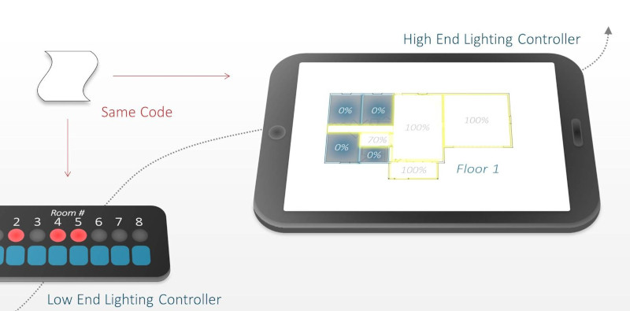
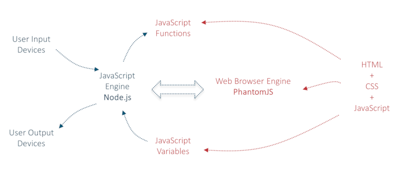

## An HTML-Based *Any-Device* User Interface for Embedded Applications

**Shortcuts:**  |
[Introduction](#introduction) |
[An Example](#an-example-home-lighting-controller) |
[Why HTML?](#why-do-this-with-html) |
[Design Overview](#design-overview) |
[More Information](#more-information) |
[License](#license) |

---

### Introduction
This project explores the use of web technologies as a means of control for (potentially remote) hardware devices.

It enables the use of typical hardware (such as buttons, LED displays, TFT LCD displays and so on) for the user interface, but with all software control (including display information, text, graphics, styles and user interface response behaviour) implemented in HTML and any other desired web technologies such as JavaScript.

**The aim** is that the same code can be used to build very different looking user interfaces. Furthermore the same code could also be used to provide remote management from a browser. The views can be displayed differently to suit the hardware. With a large screen TFT LCD the user’s experience will be different to a (say) 16-character single-line display, but both should be possible with the same code.

### An Example (Home Lighting Controller)
Just as an example, a low-cost home lighting controller with constrained user interface hardware may have just push-buttons to switch on/off lights in different rooms of the house, and LEDs (one LED per room) to indicate which rooms are switched on.

A more advanced (and expensive) home lighting controller with a TFT LCD and touch-screen may display a plan view of the home with rich graphics, a slider to select the floor of the home, and allow users to touch the desired room and show in a colored graphical image if lights are switched on or off.

If network connectivity exists then a web browser-based interface for the lighting controller may implement security including a password, and have a mode with simpler graphics and text so that it can be used from a smart phone.

The desire is to allow all of these methods of control to be possible (in a single way) for a scalable experience to suit the hardware that exists. It basically extends the usual web browser techniques to work with diverse input/output devices.

### Why do this with HTML?
HTML is great for providing information; scripts or programs (along with HTTP) provide the interactivity. In the times when graphics were not always possible simple text-only browsers like Lynx existed to provide access to HTML content. The HTML file was rendered in text-only, and any graphics were ignored. The precedent therefore already exists for HTML on constrained displays (there are also plenty of Internet of Things projects today that extract HTML content and send it to an LCD character display on wireless nodes but they often use functions such as string extraction for extremely basic HTML parsing with no scalable experience and the interaction is basic).

HTML and associated technologies such as CSS and JavaScript are attractive because they are fundamental to all web pages and therefore there is a possibility that programmers will have encountered them to some degree. No need to learn Python and other languages or technologies if you don’t want to. It also means that debugging can be simple; just run the code in a browser! There is no need to have access to the physical hardware until you are ready for it. In a team, it simplifies allowing some people to work on physical hardware while others work on low-level interfacing in software and others can work on the user interface logic and application logic.

And to be honest another reason to do this was partly curiosity: how feasible is it to build an interface using HTML and associated web technologies for a device with constrained input/output for the user interface, and could it be responsive?

### Design Overview
The heart of the design involves the need to be able to interpret HTML and JavaScript and any additional libraries. A web browser engine is used to perform these tasks. This allows the user interface programmer to create HTML based content just like any other web project. The difference is that input and output from the web browser engine is not necessarily targeted for a graphical desktop and keyboard/mouse. Instead, for display output, HTML elements and JavaScript variables can read from the page at any time to directly control any desired output device. For user input, push-buttons or any other sensor data can be pushed into the browser engine at any time. To create such a design involves constructing a usable workflow for these output and input tasks respectively. The workflows that have been prototyped are not necessarily the best ways but they function; there is plenty of scope for improvement. I only had limited time to think up a prototype.

The diagram below shows how the prototype works. All user interface related content is contained on the right side of the diagram in HTML files. This includes all text strings, images, color schemes, layout, button press rules and desired output events.

All hardware interfacing and all other functions that the system needs to support is contained on the left side of the diagram. Any programming language(s) could be used, and in this example JavaScript was chosen, executing on a software platform called Node.js.

Note that although the right side of the diagram shows JavaScript, this is unrelated to the main program running on the left side which also happens to use JavaScript in this prototype. The JavaScript on the right side is exclusively intended for user interface related activities and it runs on the separate web browser engine called PhantomJS. The left and right sides will operate like ‘ships that pass in the night’ with the bare minimal interaction.

The two sides of the diagram interact with each other through the ability to remotely influence and read activity that occurs on the right side, through an application programming interface (API) available to Node.js that allows events or variables or other content to be pushed to PhantomJS by instructing it to execute any function written in JavaScript on the right side. In a similar vein it is possible for the left side to peek inside PhantomJS and read any JavaScript variables at any time.

For an example application, a simple procedure was devised for the left and right sides to communicate through this remote function execution and variable peeking method, and it is discussed next. But first, a brief note about the software libraries and platforms used in this project: Node.JS is fast becoming a reasonably mature platform for projects, however the module that connects it to PhantomJS and PhantomJS itself are not designed for implementing user interfaces; they are designed for testing web pages so they are being used beyond their original scope. It is hoped that over time improvements can occur as these platforms continue to be developed.

### More Information
See **full blog post** at Element14 - <strong><a taget="_blank" title="Element14.com" href="http://www.element14.com/community/community/raspberry-pi/raspberrypi_projects/blog/2015/09/27/html-based-any-device-user-interface-for-embedded-applications">here</a></strong>

### License
BY-NC-SA (non-commercial use only)
*Note: This license type is under review and will be updated shortly*
